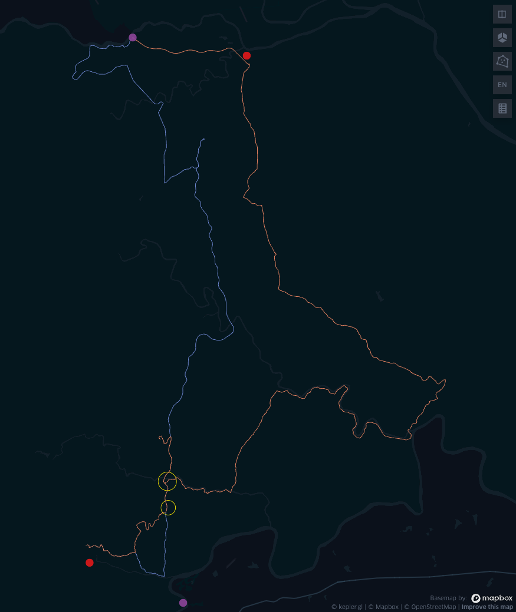

# KNP Traffic Model

In the linked video, a demo of agents moving through the park is shown. In the morning when the park opens, tourists start entering the park and driving through the park. The route-finding algorithm has to adhere to time limits, so the agents leave the park through a gate at closure or reach a rest camp for an overnight stop. The agents take a longer lunch break during the day at a gate or camp, and stop during their trips for animal sightings.

[Video of time boxed tourist navigation](./KNP-Traffic-demo.mov)

Legend of visible elements in the video: 

- Red: Rest Camps
- Purple: Gates
- Yellow circles: animal sightings
- Green: moving agents (visitors)

For one agent in the following image the randomized and time-constrained route-finding is shown. The agent starts at a park gate and drives to a rest camp within its time limit (orange route), and after its lunch break drives back to its origin gate (blue route). On its way, it stops for two animal sighting events (yellow circles).

